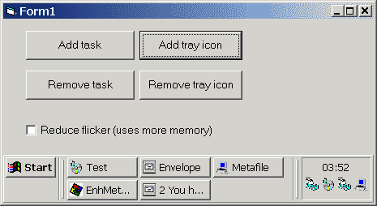

<div align="center">

## TaskBar Control


</div>

### Description

This is a UserControl i did for a recent project. It almost fully emulates Windows taskbar functionality. Written from scratch, uses heavy advanced API and subclassing.

Code greatly inspired by submissions to this site and vbAccelerator.com. Everything is done the hard way, the way a VC++ programer would do it. And btw, lots of lame code here. Don't know why people upload so much rubbish.

I'm a professional VB coder and maybe my judgement is too harsh :-)) Anyway, don't bother to vote but do comment here.

Enjoy,

</wqw>
 
### More Info
 
Well, VB IDE is totally hacked by this piece of code, but i put some effort to prevent nasty redrawing side effects.


<span>             |<span>
---                |---
**Submitted On**   |2001-05-27 03:49:12
**By**             |[Vlad Vissoultchev](https://github.com/Planet-Source-Code/PSCIndex/blob/master/ByAuthor/vlad-vissoultchev.md)
**Level**          |Advanced
**User Rating**    |4.8 (38 globes from 8 users)
**Compatibility**  |VB 5\.0, VB 6\.0
**Category**       |[Custom Controls/ Forms/  Menus](https://github.com/Planet-Source-Code/PSCIndex/blob/master/ByCategory/custom-controls-forms-menus__1-4.md)
**World**          |[Visual Basic](https://github.com/Planet-Source-Code/PSCIndex/blob/master/ByWorld/visual-basic.md)
**Archive File**   |[TaskBar Co201085262001\.zip](https://github.com/Planet-Source-Code/vlad-vissoultchev-taskbar-control__1-23482/archive/master.zip)

### API Declarations

```
'see mdWinAPI,bas -- 300+ lines
```


